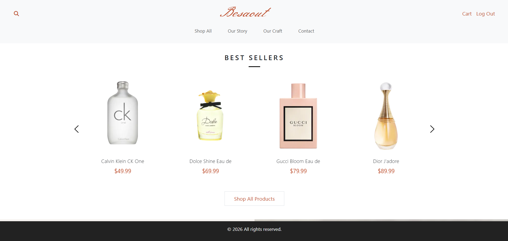
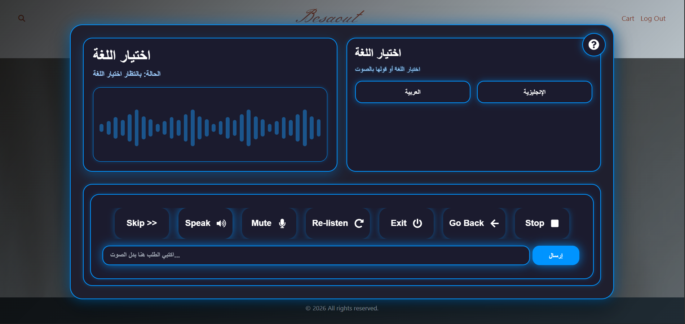
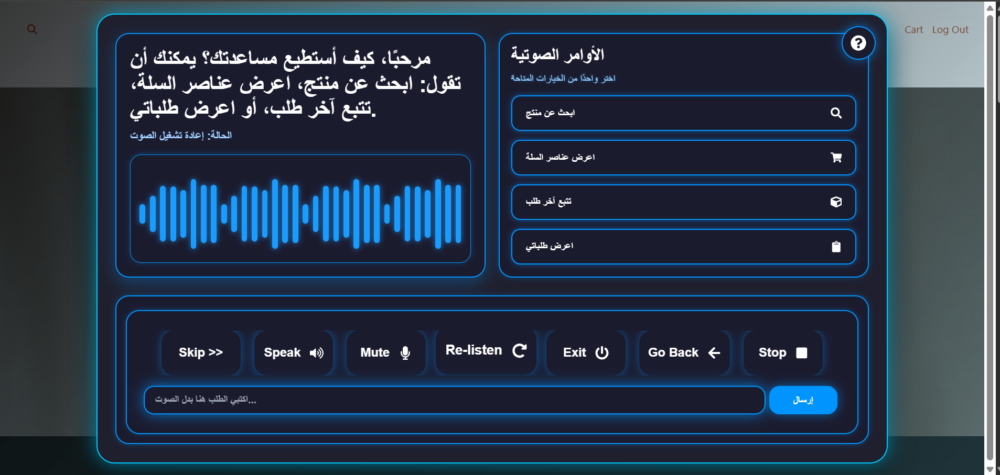
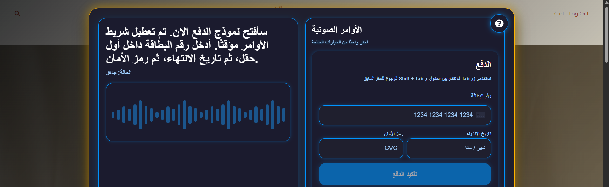

# Graduation Project

A full-stack eCommerce platform with accessibility and voice-assistant features.

## Technologies

- React and Vite
- ASP.NET Core Web API (.NET 9)
- Entity Framework Core
- SQL Server
- Browser Extension
- OpenAI API
- Stripe
- Cloudinary

## Project Structure

- `backend/` — ASP.NET Core API
- `frontend/` — React website
- `browser-extension/` — Voice accessibility extension

## Requirements

Install the following:

- Node.js
- .NET 9 SDK
- SQL Server or SQL Server LocalDB
- Google Chrome

## Backend Setup

From the project root:

```powershell
cd backend/MyApi.PLL
dotnet restore
```

Configure the required secrets locally:

```powershell
dotnet user-secrets set "ConnectionStrings:DefaultConnection" "YOUR_CONNECTION_STRING"
dotnet user-secrets set "Jwt:SecretKey" "YOUR_JWT_SECRET"
dotnet user-secrets set "Stripe:SecretKey" "YOUR_STRIPE_SECRET"
dotnet user-secrets set "CloudinarySettings:CloudName" "YOUR_CLOUD_NAME"
dotnet user-secrets set "CloudinarySettings:ApiKey" "YOUR_CLOUDINARY_API_KEY"
dotnet user-secrets set "CloudinarySettings:ApiSecret" "YOUR_CLOUDINARY_API_SECRET"
dotnet user-secrets set "OpenAI:ApiKey" "YOUR_OPENAI_API_KEY"
dotnet user-secrets set "EmailSettings:SenderEmail" "YOUR_EMAIL"
dotnet user-secrets set "EmailSettings:AppPassword" "YOUR_EMAIL_APP_PASSWORD"
```

Example LocalDB connection string:

```text
Server=db45639.public.databaseasp.net;Database=db45639;User Id=db45639;Password=R#i9z5-N%xX8;Encrypt=True;TrustServerCertificate=True;MultipleActiveResultSets=True;
```

Run the backend:

```powershell
dotnet run
```

The API should run locally using the addresses shown in the terminal.

## Frontend Setup

Open another terminal from the project root:

```powershell
cd frontend
npm install
```

Create the local environment file:

```powershell
Set-Content -LiteralPath ".env" -Value "VITE_API_URL=https://localhost:7291" -Encoding UTF8
```

The `.env` file should contain:

```env
VITE_API_URL=https://localhost:7291
```

Run the frontend:

```powershell
npm run dev
```

Open the application:

```text
http://localhost:5173
```

> The `.env` file is local and must not be committed to GitHub.

## Browser Extension Setup

From the project root:

```powershell
cd browser-extension
npm install
npm run build
```

Then:

1. Open Chrome.
2. Navigate to `chrome://extensions`.
3. Enable **Developer mode**.
4. Select **Load unpacked**.
5. Choose the `browser-extension/dist` folder.

## Screenshots

### Website




### Browser Extension






## Security

Sensitive credentials are not included in this repository.

Each developer must configure their own:

- Database connection string
- JWT secret
- Stripe secret key
- Cloudinary credentials
- OpenAI API key
- Email address and Google App Password

Never commit real credentials, `.env` files, or `secrets.json`.

## Contributors

- Leena Abd Alrahman
- Aseel Saleh